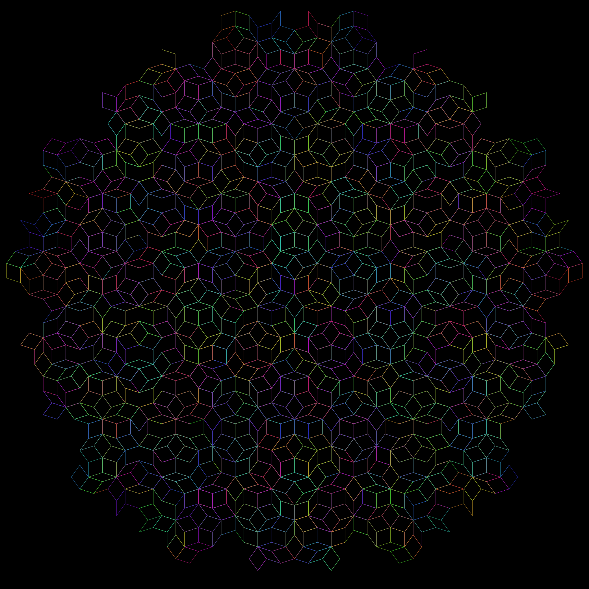
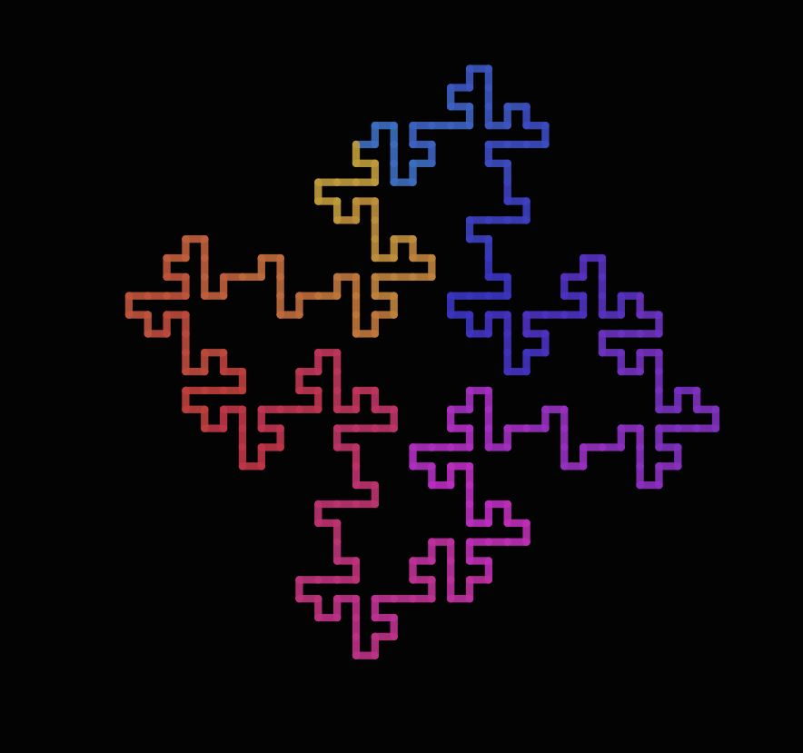

# Lindenmayer (L-systems)

L-systems were introduced and developed in 1968 by Aristid Lindenmayer, a
Hungarian theoretical biologist and botanist at the University of Utrecht.
Lindenmayer used L-systems to describe the behaviour of plant cells and to model
the growth processes of plant development. L-systems have also been used to
model the morphology of a variety of organisms and can be used to generate
self-similar fractals such as iterated function systems.

(Images generated by `../test/runtests.jl`, cropped, then converted to PNG.)

In this module, a Lindenmayer System (LSystem) object consists of:

- Rules:
    a dictionary of transformation rules that
    replace a character with one or more

- Initial state:
    the initial state for the system (also called "the Axiom")

- State:
    the current evolved state (initially empty, added when the system is evaluated)

To draw the LSystem, we use a Turtle, as in Turtle Graphics, which responds to instructions such as Forward and Turn. Each individual character used is assigned a sequence of one or more graphics commands. For example, "F" converts to "Forward()". This is hard-coded in the `render()` function. Graphics are currently provided by Luxor.jl.

You can define an L-System like this:

koch = LSystem(Dict("F" => "F+F--F+F"), "F")

This says: there's one rule; replace "F" with "F+F--F+F" for each iteration. And start off with an initial state consisting of just a single "F". The first iteration therefore draws four lines, and changes direction at the end of each one. The length of the lines and the angle of the turn can be specified when you evaluate the LSystem.

To evaluate and draw a Lindenmayer system, use one of the following:

    drawLSystem(lsystem::LSystem)
    drawLSystem(lsystem::LSystem, forward=30, turn=45, iterations=6)
    drawLSystem(lsystem::LSystem, filename="/tmp/lsystem.pdf")

Keyword options include:

    forward=15,
    turn=45,
    iterations=3,
    filename="/tmp/lsystem.pdf",
    debugging=false,
    width=1000,
    height=1000,
    startingpen=(0.3, 0.6, 0.8), # starting color RGB
    startingx=0,
    startingy=0,
    startingorientation=0,
    showpreview=true

You can vary the line width using Turtle commands "1", "2", "3", "4", "5" to select the appropriate line width in points, or "n" to choose a narrow 0.5.

Another example:

    hilbert = LSystem(Dict(
        "L" => "+RF-LFL-FR+",
        "R" => "-LF+RFR+FL-"),
        "L")
    drawLSystem(hilbert, forward=5, turn=90, iterations=6, filename="/tmp/hilbert.pdf")

Internally the State is stored as an array of integers (I thought it would probably be faster than very long strings — about half a million is typical — although I didn't test it), but the rules and initial state are stored as strings.
