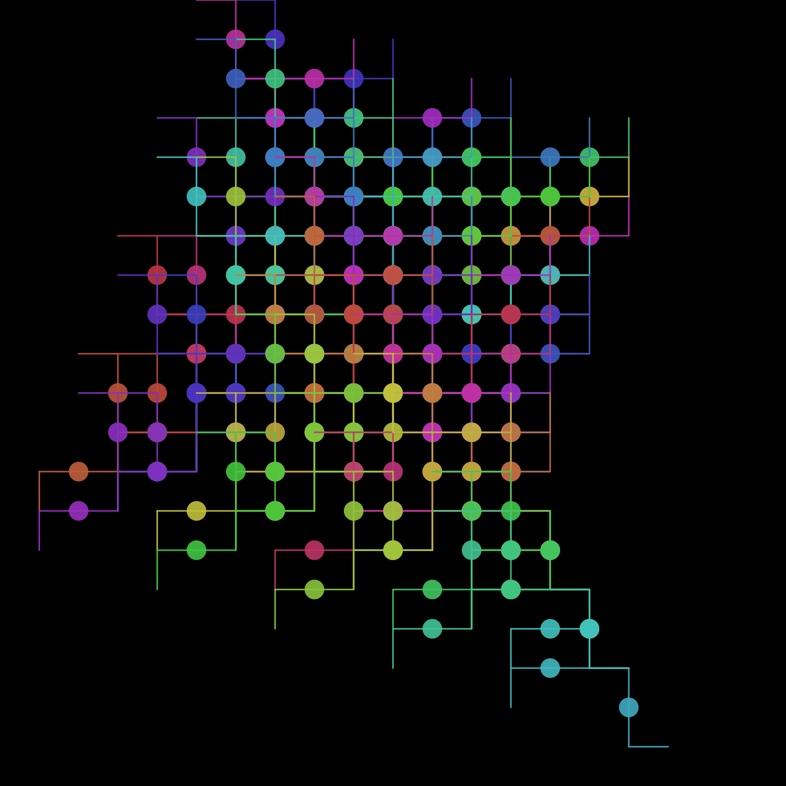
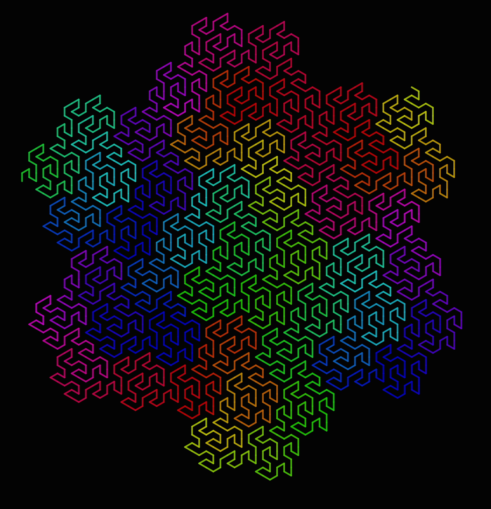
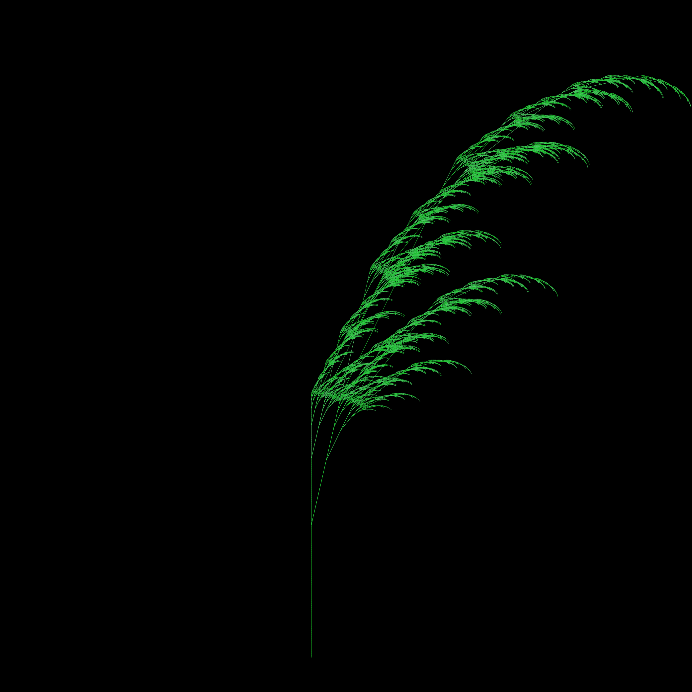
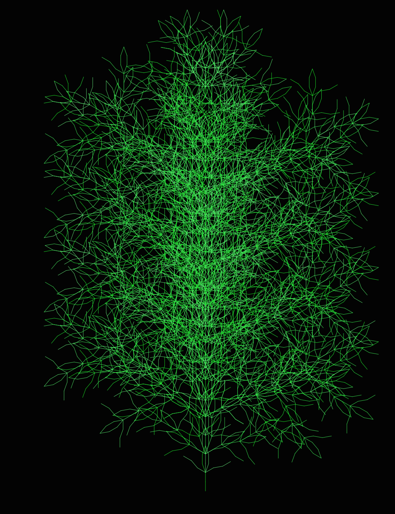

# Examples


## Stack use

This example shows the use of the `[` and `]` stack push and pop commands.

```
simple  = LSystem(Dict("F" => "F[t+FoF-F]"), "F")
drawLSystem(simple,
   forward     = 50,
   turn        = 90,
   iterations  = 6,
   startingx   = 0,
   startingy   = -150,
   filename    = "simple.pdf",
   showpreview = false)
```




## Koch

>The Koch snowflake (also known as the Koch curve, Koch star, or Koch island) is a fractal curve and one of the earliest fractals to have been described. It is based on the Koch curve, which appeared in a 1904 paper titled "On a Continuous Curve Without Tangents, Constructible from Elementary Geometry" by the Swedish mathematician Niels Fabian Helge von Koch.

(Wikipedia)

```
koch = LSystem(Dict("F" => "F+F-"), "F") # use turn of 60 degrees
drawLSystem(koch,
   forward     = 5,
   turn        = 60,
   iterations  = 6,
   startingx   = -1800,
   startingy   = 0,
   width       = 4000,
   height      = 4000,
   filename    = "koch.pdf",
   showpreview = false)
```


```
quadratic_Koch = LSystem(Dict("F" => "F+F--F+F"), "F") # 4 # 60 degrees
drawLSystem(quadratic_Koch,
   forward     = 10,
   iterations  = 2,
   turn        = 90,
   filename    = "quadratic_koch.pdf",
   showpreview = false)
```

```
koch_snowflake = LSystem(Dict("F" => "F+F--F+F"), "F-F-F")
```

```
quadratic_Koch = LSystem(Dict("F" => "tF-F+F+FFF-F-F+F"), "4F+F+F+F")
```


## Peano

The Peano curve is the first example of a space-filling curve to be discovered, by Giuseppe Peano in 1890.

```
peano = LSystem(Dict("F" => "TF+F-F-toF-F+F+F+F-F"), "3F")
drawLSystem(peano,
   turn        = 90,
   forward     = 20,
   iterations  = 3,
   startingx   = -250,
   filename    = "peano.pdf",
   showpreview = false)
```


## Peano Gosper

The Peano-Gosper curve is a plane-filling function originally called a "flowsnake" by Bill Gosper and Martin Gardner. The name was invented by Benoit Mandelbrot.

```
peano_gosper = LSystem(Dict(
   "X" => "X+YF++YF-tFX--FXFX-YF+",
   "Y" => "-FX+YFYF++YF+FX--FX-Y" ),
   "FX")  # turn 60°

drawLSystem(peano_gosper,
   forward             = 10,
   turn                = 60,
   iterations          = 4,
   startingpen         = (0, 0.8, 0.2),
   startingorientation = -pi/2,
   startingx           = -200,
   startingy           =  -50,
   filename            = "peano-gosper.pdf",
   showpreview         = false)
```



## 32 segments

```
thirty_two_segment = LSystem(Dict(
   "F" => "t-F+F-F-F+F+FF-F+F+FF+F-F-FF+FF-FF+F+F-FF-F-F+FF-F-F+F+F-F+"),
   "F+F+F+F")

drawLSystem(thirty_two_segment,
   forward=5,
   iterations=2,
   turn=90,
   filename="32segments.pdf",
   showpreview=false)
```


## Sierpinski

```
sierpinski_triangle = LSystem(Dict(
   "F" => "G+F+Gt",
   "G" => "F-G-F"),
   "G") # 60°

drawLSystem(sierpinski_triangle,
   forward=3,
   startingx=-400,
   startingy= -350,
   turn=60,
   iterations=8,
   filename="sierpinski-triangle.pdf",
   showpreview=false)
```


```
square_curve = LSystem(Dict(
   "X" => "XF-F+F-XF+F+XtF-F+F-X"),
   "F+XF+F+XF")
```

## Dragon curves

```
dragon_curve = LSystem(Dict(
   "F" => "F+G+t",
   "G" => "-F-G"),
   "F") #  90 degrees

drawLSystem(dragon_curve,
   forward     = 12,
   turn        = 90,
   iterations  = 10,
   filename    = "dragon_curve.pdf",
   showpreview = false)
```


## Hilbert curves

A Hilbert curve (also known as a Hilbert space-filling curve) is a continuous fractal space-filling curve first described by the German mathematician David Hilbert in 1891, as a variant of the space-filling Peano curves discovered by Giuseppe Peano in 1890.

```
hilbert_curve = LSystem(Dict(
   "L" => "+RF-LFL-tFR+",
   "R" => "-LF+RFR+FL-"),
   "3L") # 90°
drawLSystem(hilbert_curve,
   forward     = 25,
   turn        = 90,
   iterations  = 4,
   startingx   = -200,
   startingy   = -200,
   filename    = "hilbert_curve.pdf",
   showpreview = false)
```


```
hilbert = LSystem(Dict(
   "L" => "+RF-LFL-cFR+",
   "R" => "-LF+RFR+FL-"),
   "1L")

drawLSystem(hilbert,
   forward     = 12,
   turn        = 90,
   iterations  = 6,
   startingx   = -450,
   startingy   = -450,
   filename    = "hilbert.pdf",
   showpreview = false)
```


```
hilbert_curve2 = LSystem(Dict(
   "X" => "XFYFX+F+YFXFcY-F-XFYFX",
   "Y" => "YFXFY-F-XFYFX+F+YFXFY"),
   "2X")

drawLSystem(hilbert_curve2,
   forward     = 10,
   turn        = 90,
   iterations  = 4,
   startingx   = -450,
   startingy   = -450,
   filename    = "hilbert_curve2.pdf",
   showpreview = false)
```


## Plants

```
plant = LSystem(Dict(
   "F" => "F[-F]cF[+F][F]"),
   "F") # use turn eg 17° or 23°

drawLSystem(plant,
   forward             = 7,
   startingpen         = (0, 0.8, 0.3),
   startingx           = 0,
   startingy           =  460,
   startingorientation = -pi/2,
   turn                = 23,
   iterations          = 6,
   filename            = "plant.pdf",
   showpreview         = false)
```


```
plant1 = LSystem(Dict(
   "F" => "FF",
   "X" => "F−[[cX]+X]+F[+FX]−X"),
   "1X")

drawLSystem(plant1,
   forward             = 3,
   turn                = 13,
   iterations          = 7,
   startingpen         = (0, 0.8, 0.2),
   startingorientation = -pi/2,
   startingx           = -50,
   startingy           =  450,
   filename            = "plant1.pdf",
   showpreview         = false)
```



```
branch  = LSystem(Dict(
   "F" => "FF-[F+F+Fc]+[+F-F-F][+++F+F-F---][---F+F-F---]"),
   "1FFFF")

drawLSystem(branch,
   forward             = 12,
   turn                = 20,
   iterations          = 3,
   startingpen         = (0, 0.9, 0.2),
   startingorientation = -pi/2,
   startingx           = 0,
   startingy           =  300,
   filename            = "branch.pdf",
   showpreview         = false)
```



## Penrose tiling

```
penrose = LSystem(Dict(
   "X"  =>  "PM++QM----YM[-PM----XM]++t",
   "Y"  => "+PM--QM[---XM--YM]+t",
   "P"  => "-XM++YM[+++PM++QM]-t",
   "Q"  => "--PM++++XM[+QM++++YM]--YMt",
   "M"  => "F",
   "F"  => ""),
   "1[Y]++[Y]++[Y]++[Y]++[Y]") # 36 degrees

drawLSystem(penrose,
   forward             = 25,
   turn                = 36,
   iterations          = 7,
   startingpen         = (.5, 0.8, 0.2),
   startingorientation = -pi/2,
   startingx           = 0,
   startingy           = 0,
   filename            = "penrose.pdf",
   showpreview         = false)
```


